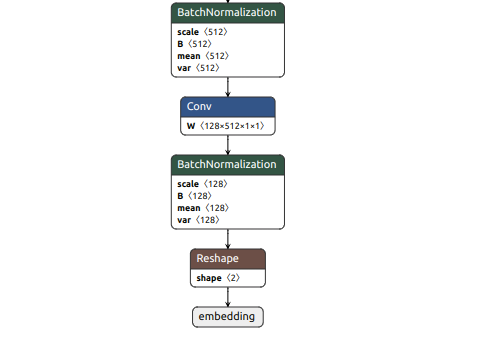
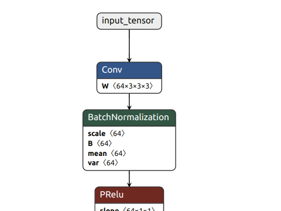

## onnx -> hef하기
### How?
- Hailo Dataflow Compiler를 다운받는다
- https://hailo.ai/developer-zone/documentation/dataflow-compiler-v3-31-0/?sp_referrer=install/install.html 이 링크를 따라간다

### 가상환경 만들 때
```shell
python -m venv venv
```
- 이렇게 만들어서 pip install 하면 안된다
- ㄹㅇ 시키는대로 해야 함

### 설치 후 hailo -h를 실행했을 때
```shell
(myenv) godputer@godputer:~/S12P31C203$ hailo -h
[info] First time Hailo Dataflow Compiler is being used. Checking system requirements... (this might take a few seconds)
[Error] Requirement python3-tk not found.
[Error] See full log: /home/godputer/S12P31C203/.install_logs/hailo_installation_log_2025.05.07T08:42:19.log
[Warning] CUDNN version should be 8.9 or higher, found 9.8.
Component                                Requirement                    Found                               
==========  ==========       ==========  ==========                                                         
OS                                       Ubuntu               Ubuntu                                        Required
Release     20.04                        22.04                                       Required               
Package     python3-tk                   X                    Required                                      
Package     graphviz                     V                    Required                                      
Package     libgraphviz-dev              V                    Required                                      
Package     python3.10-dev               V                    Required                                      
RAM(GB)     16                                                                       Required               
RAM(GB)     32                                                                       Recommended            
CPU-Arch                                              x86_64  x86_64                              Required  
CPU-flag                                              avx     V                      Required               
GPU-Driver                                            525     570       Recommended                         
CUDA                                                  11.8              Recommended                         
CUDNN                                                 8.9     9.8       Recommended                         
Var:CC                       unset                    unset             Required                            
Var:CXX                      unset                    unset             Required                            
Var:LD                       unset                    unset             Required                            
Var:AS                       unset                    unset             Required                            
Var:AR                       unset                    unset             Required                            
Var:LN                       unset                    unset             Required                            
Var:DUMP                     unset                    unset             Required                            
Var:CPY                      unset                    unset             Required                            
System requirements check failed (see table above for details). Continue? [Y/n]
[info] Current Time: 08:42:34, 05/07/25
[info] CPU: Architecture: x86_64, Model: 11th Gen Intel(R) Core(TM) i7-11600H @ 2.90GHz, Number Of Cores: 12, Utilization: 4.1%
[info] Memory: Total: 31GB, Available: 25GB
[info] System info: OS: Linux, Kernel: 6.8.0-58-generic
[info] Hailo DFC Version: 3.31.0
[info] HailoRT Version: Not Installed
[info] PCIe: No Hailo PCIe device was found
[info] Running `hailo -h`
usage: hailo [-h] [--version]
             {analyze-noise,compiler,params-csv,parser,profiler,optimize,tb,visualizer,tutorial,har,join,har-onnx-rt,runtime-profiler,dfc-studio,help} ...

Hailo Command Line Utility

positional arguments:
  {analyze-noise,compiler,params-csv,parser,profiler,optimize,tb,visualizer,tutorial,har,join,har-onnx-rt,runtime-profiler,dfc-studio,help}
                        Hailo utilities aimed to help with everything you need
    analyze-noise       Analyze network quantization noise
    compiler            Compile Hailo model to HEF binary files
    params-csv          Convert translated params to csv
    parser              Translate network to Hailo network
    profiler            Hailo models Profiler
    optimize            Optimize model
    tb                  Create Tensorboard summary for Tensorflow model
    visualizer          HAR visualization tool
    tutorial            Runs the tutorials in jupyter notebook
    har                 Query and extract information from Hailo Archive file
    join                Join two Hailo models to a single model
    har-onnx-rt         Generates ONNX-Runtime model including pre/post processing
    runtime-profiler    Hailo Runtime Profiler
    dfc-studio          Start DFC Studio
    help                Show the list of commands

options:
  -h, --help            show this help message and exit
  --version             show program's version number and exit
```

### 이거 없다고 하니까 일단 설치하자
```shell
Package     python3-tk                   X                    Required                                      
```

- 이렇게 설치하면 됨
```shell
sudo apt update
sudo apt install python3-tk
```

## ONNX -> Hailo 과정
#### 1. Parsing (HAR 파일 생성)
#### 2. Optimization (양자화 및 최적화)
#### 3. Compilation (HEF 파일 생성)

### 1단계:Parsing - ONNX 모델을 HAR로 변환
먼저, ONNX 모델을 Hailo의 내부 표현 형식인 HAR(Hailo Archive) 파일로 변환해야 함.

```bash
hailo parser onnx --input-files xx.onnx --output-har xx.har
```
- `xx.onnx`: 변환하려는 ONNX 모델 파일
- `xx.har`: 생성될 HAR 파일의 이름

### 2단계: Optimization – 양자화 및 최적화
HAR 파일을 생성한 후, 이를 최적화하여 양자화된 HAR 파일을 생성합니다.
```bash
hailo optimize --input model.har --output model_optimized.har --use-random-calib-set
```
- `--use-random-calib-set`: 임의의 데이터셋을 사용하여 양자화를 수행합니다. 실제 데이터셋을 사용하는 것이 더 정확한 결과를 얻을 수 있습니다.

### 3단계: Compilation – HEF 파일 생성
최적화된 HAR 파일을 사용하여 HEF 파일을 생성합니다.
```bash
hailo compiler --input model_optimized.har --output model.hef
```
- `model.hef`: 생성될 HEF 파일의 이름입니다.

이 단계에서 오류가 발생할 경우, 모델의 구조나 양자화 설정을 다시 검토해야 합니다. 특히, 복잡한 모델에서는 컴파일 시간이 길어질 수 있으며, 이로 인해 타임아웃 오류가 발생할 수 있습니다.


## 1단계에서 삽질
```bash
hailo parser onnx --input-files xx.onnx --output-har xx.har
```

- 이거 실행하면 파싱 오류 발생
- 이유는 paddle에서 onnx모델로 변환할 때 뭔가 오류가 있기 때문

### 일단 onnx 모델 입력과 출력 이름을 잘 설정해보자
- onnx 라이브러리 사용해서 이름 잘 바꿀 수 있음
- netron으로 변경사항들 그림으로 확인 가능



- 입력 이름도 x가 아니라 다른걸로 바꿔보자



- 일단 되긴 함
- 다시 해보자 이름 지정해서

### 잠깐잠깐. paddle에서 onnx로 변환할 때 동적 shape로 설정되어 있음
- 그래서 동적 shape라서 hailo가 못 하는 거
- 이걸 정적으로 바꿔야 함

- 근데 paddle 명령어에서 안되는데?
- onnx에서 그냥 강제 수정해버리기 해보자
``` py
import onnx
from onnx import helper, TensorProto

model = onnx.load("mobilefacenet.onnx")

# 🔧 입력 이름 수정
old_input_name = model.graph.input[0].name
model.graph.input[0].name = "input_image"

for node in model.graph.node:
    for i, name in enumerate(node.input):
        if name == old_input_name:
            node.input[i] = "input_image"

# 🔧 출력 이름 수정
old_output_name = model.graph.output[0].name
model.graph.output[0].name = "embedding"

for node in model.graph.node:
    for i, name in enumerate(node.output):
        if name == old_output_name:
            node.output[i] = "embedding"

# 🔧 입력 shape 고정
model.graph.input[0].type.tensor_type.shape.dim[0].dim_value = 1
model.graph.input[0].type.tensor_type.shape.dim[1].dim_value = 3
model.graph.input[0].type.tensor_type.shape.dim[2].dim_value = 112
model.graph.input[0].type.tensor_type.shape.dim[3].dim_value = 112

# 🔧 출력 shape 고정
model.graph.output[0].type.tensor_type.shape.dim[0].dim_value = 1
model.graph.output[0].type.tensor_type.shape.dim[1].dim_value = 128

# 저장
onnx.save(model, "mobilefacenet_final.onnx")
```
### 안된다 그냥 batchnormalization까지 파싱하고 후처리로 128차원 뽑자
- 아. 일단 안되는데 된다 쳐도 모델의 데이터셋을 맥여서 변환해야 함

## 자 tappas에 있는 예제 돌려보는걸로 전환

