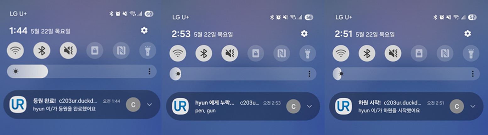
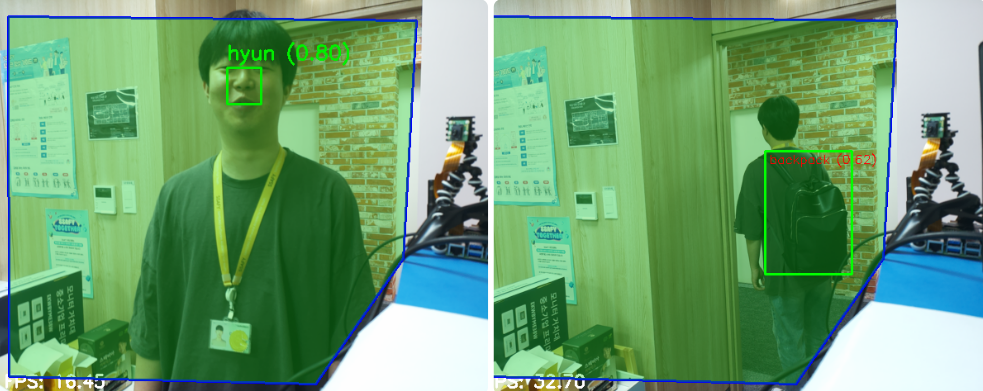

# 어린이집 AI·AR 케어 서비스 : UR

## 개요

본 서비스는 **인공지능 얼굴 인식 기술**과 **AR(증강현실) 디바이스**를 접목해 아동의 등·하원 현황을 자동으로 기록하고, 실시간으로 아동의 특이사항을 시각적으로 제공하는 스마트 안전관리 솔루션입니다.

교사는 AR 안경을 통해 아동의 얼굴을 인식함과 동시에 해당 아동의 알러지, 건강상태, 감정 변화, 유의사항 등을 확인할 수 있어 보다 정밀하고 즉각적인 돌봄이 가능합니다. 이를 통해 유치원 내 사고를 예방하고, 교육 현장의 업무 효율성을 크게 향상시키는 것을 목표로 합니다.

## 기획 배경

최근 유아 교육 현장에서는 **아동의 짐 분실**, **식품 안전 사고**가 꾸준히 발생하고 있습니다. 특히 교사 1인이 다수의 아동을 관리하는 구조에서는 개별 아동의 특성을 일일이 파악하기 어려워, 불의의 상황에 신속하게 대응하지 못하는 한계가 존재합니다.

또한 반복되는 수기 출결 관리 및 특이사항 기록 업무는 교사에게 **과도한 행정 부담**을 주고 있습니다. 이러한 문제를 해결하기 위해, 본 서비스는 AI 기술과 AR 기술을 융합하여 아동의 상태를 실시간으로 시각화하고, 출결 및 특이사항 관리의 자동화를 통해 교사의 업무 부담을 줄이며 아동 안전을 획기적으로 강화하는 방향으로 기획되었습니다.

## 👥 팀원 소개 / 역할

| **이름** | 신용현 |      김의현       |    신동욱    | 서무성 | 한승우 | 김민철 | 이두호 |
| :------: | :----: | :---------------: | :----------: | :----: | :----: | :----: | :----: |
| **역할** |  팀장  | PM, BE, FE, Infra | Embedded, AI | FE, AR |   AI   | AR, AI |   AR   |

## 1. 개발 환경

- _Front-end_ : react, axios, PWA, TypeScript
- _Back-end_ : SpringBoot, JPA, SpringSecurity
- _Embedded_ : raspberry pi5, MQTT, OpenCV, Hailo-8(AI 가속기), IMX500(AI camera)
- _AI_ : YOLO11n, MobileFaceNet, MediaPipe
- _AR_ : Unity, Nreal SDK
- _버전 및 이슈관리_ : GitLab
- _협업 툴_ : Mattermost, Notion, Jira

## 2. 기능 소개

### 1. 아이 얼굴을 인식해 정보 오버레이

### 2. 등·하원 알림 및 두고간 짐 리스트 알림

### 3. 교사용 웹 브라우저 화면

- 로그인 화면

- 메인화면(일정, 공지사항, 출석현황, 아동 정보보)

- 아동관리 페이지

- 아동 추가 화면

- 부모 계정 관리 페이지

- 앨범

- 앨범 디테일 페이지

### 4. 학부모용 모바일 화면

- 로그인 화면

- 메인 화면(공지사항, 일정)

- 메인화면(아동 앨범)

- 아동 앨범 상세(날짜별 나열)

## 3. 회고

### 신용현

저는 이번 프로젝트에서 팀장으로서 서번트 리더십을 바탕으로 팀원들이 각자의 역할에 집중할 수 있도록 지원하는 데 힘썼습니다. 프로젝트 초기에는 전체적인 방향을 설정하며 기획서를 작성했고 필요한 장비를 검토한 후 적절한 제품을 선정하여 구입 명세서를 작성하고 구매 절차를 진행했습니다. 이후 우산 사진 약 8,000장과 사람 얼굴 사진 약 1,000장을 직접 수집하고 정리했으며 이를 활용해 AI 카메라 동작 실험을 수행했습니다. Hailo에서 제공하는 객체 인식 모델을 적용하여 실제 환경에서의 인식 가능성을 검토했고 테스트 결과를 팀원들과 공유하며 함께 개선 방향을 논의했습니다.

### 김의현
이번 프로젝트에서는 임베디드, 프론트엔드, 백엔드, CI/CD 등 모든 영역을 혼자 담당해야 했습니다. 특히 임베디드 연동과 CI/CD는 처음 다뤄보는 분야라 초반에는 구조를 이해하는 데 어려움이 많았습니다.
그러나 직접 부딪혀 해결해 나가는 과정에서 많은 것을 배웠고, 다양한 기술을 빠르게 습득할 수 있었습니다. 앞으로는 새로운 기술을 맡게 될 경우, 본격적인 개발 전에 사전 테스트와 기록을 습관화해 효율적으로 대응하고자 합니다.
이번 경험을 통해 MQTT, Raspberry Pi 연동, Spring Security 확장, GitLab-Jenkins-Docker 기반의 CI/CD 구성 등 실무 역량을 크게 키울 수 있었고, 시스템 전반을 아우르는 풀스택 경험도 쌓을 수 있었습니다. 무엇보다 역할이 많아질수록 설계와 문서화, 커뮤니케이션의 중요성을 깊이 느꼈습니다.

### 신동욱

카메라를 이용해서 출결을 관리하고, 두고간 짐을 알려준다는 생각을 기술로 구현하는 과정이 재밌었습니다. 얼굴 인식 모델이나, Hailo라는 AI 가속기를 활용해서 라즈베리파이에서 얼굴인식과 오브젝트 디텍션을 수행하는 과정 속에서 딥러닝 모델의 구조에 대해 조금 더 깊이 알 수 있는 계기가 되었습니다. 특히 Hailo 가속기에서 추론하려면 전처리와 후처리를 직접 구현해야 한다는 점을 깨달았고, 이를 적용해 프로젝트를 성공적으로 마무리할 수 있었습니다. 또한 YOLO s 모델이 접힌 우산을 정확히 인식하지 못하는 반면, 자율주행 대회 준비 당시 라바콘 데이터셋으로 약 3,000장을 학습시킨 s 모델은 잘 탐지했던 경험을 통해, 어떤 객체는 인식 성능이 뛰어나고 어떤 객체는 그렇지 않을 수 있다는 점도 배우게 되었습니다.

### 서무성
이번 프로젝트를 통해 React와 TypeScript를 활용한 대규모 웹 애플리케이션 개발 경험을 쌓을 수 있었습니다. 프론트엔드 아키텍처 설계부터 PWA 기능 구현, 디자인 시스템 적용, 타입 안전성 확보까지 전 과정을 경험하며 한 단계 성장할 수 있었습니다. 비록 몇 가지 아쉬운 점들이 있었지만, 이는 다음 프로젝트에서 개선할 수 있는 소중한 경험이 되었습니다. 앞으로도 지속적인 학습과 개선을 통해 더 나은 개발자로 성장해 나가겠습니다. 그리고 Unity와 nreal Light(nrsdk)를 활용하여 사용자 정보를 화면에 띄우는 역할을 했습니다. 사용자의 시선에서 정보를 즉시 제공하는 경험을 구현하면서, AR UI/UX 설계의 중요성과 실시간 처리 최적화의 필요성을 깊이 체감한 프로젝트였습니다.

### 한승우

객체 인식을 위해 데이터를 수집하고 라벨링 및 전처리 과정을 거쳐 YOLO 모델을 개발했습니다.
초기 데스크탑 환경에서는 yolo11m(Medium) 모델로 무난한 성능을 확인했으나, Hailo AI 가속기가 지원하는 yolo11n(Nano) 모델로 경량화를 시도하자 인식률이 크게 하락했습니다.
이 문제를 해결하기 위해 데이터 보강, 증강 기법 적용, 전이 학습 도입, 파라미터 튜닝 등 여러 시도를 거쳤지만, 결국 완전한 개선에 실패하여 프로젝트 일정이 지연되었습니다.
이번 경험을 통해 모델 최적화에 대해 깊이 공부할 수 있었으며, 문서화와 커뮤니케이션의 중요성을 다시 한 번 깨달았습니다.

### 김민철

AR 글라스(Nreal Light)와 Unity를 활용해 사람 얼굴을 인식하고, 인식된 사람 정보를 AR 화면 상에 띄우는 기술을 구현했습니다. 객체 인식 모델인 YOLOv4 기반에 얼굴 인식이 가능하도록 학습된 Yunet_2023_mar.onnx 모델을 활용해 얼굴을 인식하고, 좌우 눈, 코, 입꼬리 등 5개의 얼굴 랜드마크를 이용해 얼굴 정렬 및 사이징을 진행하였습니다. 정제된 얼굴 이미지를 MobileFaceNet에 입력하여 512차원의 임베딩 벡터를 추출하고, 이를 미리 저장된 데이터베이스와 비교하여 얼굴을 인식하는 방식으로 시스템을 구성했습니다. 추가로, 팀원이 구현한 손 제스처 인식 기능과 연동해 특정 손동작 시 사진 캡처 및 서버 전송 기능을 구현했으며, 해당 기능은 비동기로 처리하여 실시간 얼굴 인식 성능에 영향을 주지 않도록 설계하였습니다.

### 이두호

Unity와 NRSDK는 처음 다루는 플랫폼이었기에 낯설고 어려움도 많았지만, 제스처 인식 기능과 글래스 화면의 실시간 스트리밍 기능을 직접 구현하였습니다. 특히 Unity 내부에서 매 프레임마다 카메라 화면을 캡처하고 MJPEG 서버를 구성해 외부 PC에서 실시간으로 확인할 수 있도록 처리한 경험은, 실시간 영상 처리와 네트워크 통신에 대한 이해를 넓힐 수 있는 계기가 되었습니다. 처음에는 단순히 예제를 따라가기에 급급했지만, 점차 기능을 직접 설계하고 최적화하는 단계까지 나아가며 Unity 활용 역량도 높아졌다고 느꼈습니다.

## Etc.

- [노션 링크](https://www.notion.so/C203-PJT-UR-1d5a4bb411e98050b074da82f6a3036b)
- [UR\_최종\_ppt.pdf](/uploads/cd814077047a71bc8e2b3ebde9209d42/UR_최종_ppt.pdf)
